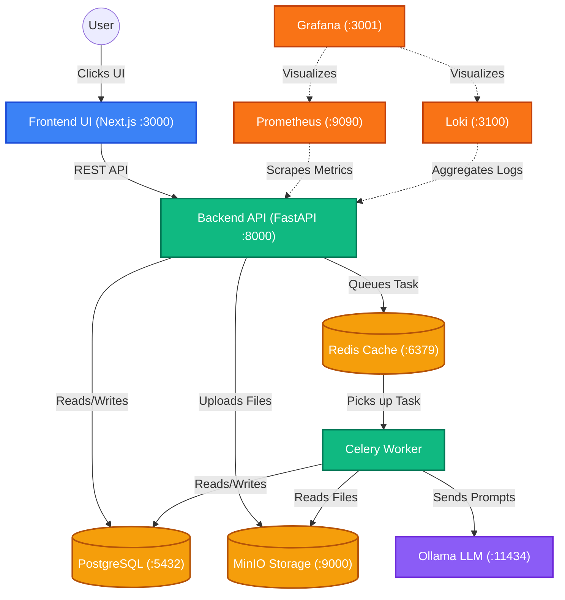

# AgentHive Architecture

## Architecture Style

Use a modular monolith that is microservice-ready.

Start with one backend project, but keep modules clean enough to split later.

```text
backend/app/
  api/
  agents/
  llm/
  tools/
  workflows/
  memory/
  jobs/
  logging/
```

> **Developer Note**: For a complete list of testing URLs and detailed data flow instructions, please read the [SYSTEM ARCHITECTURE AND TESTING GUIDE](file:///c:/python/AgentHive/docs/SYSTEM_ARCHITECTURE_AND_TESTING_GUIDE.md).

## High-Level Data Flow



## Main Request Flow

1. User sends request from dashboard.
2. Nginx forwards request to FastAPI.
3. FastAPI creates request ID and trace ID.
4. Agent Orchestrator receives task.
5. Orchestrator selects the correct agent or workflow.
6. Agent loads config, prompt version, tool permissions, memory settings.
7. LLM Router selects primary model.
8. Model Policy Engine checks token budget, provider health, rate limits.
9. Provider Adapter calls Gemini or fallback model.
10. Tool calls run if allowed.
11. Every step is logged.
12. Final result returns to dashboard.
13. Agent run timeline is visible in logs UI.

## Agent Runtime

Agents must not directly call Gemini, GPT, Ollama, or Hugging Face. Agents call the LLM Router.

Correct:

```text
Agent -> LLMRouter -> ProviderAdapter -> Model
```

Wrong:

```text
Agent -> Gemini directly
```

## LLM Fallback Policy

Default:

```text
Primary: Gemini
Secondary: Ollama
Fallback order: Gemini -> Ollama -> Hugging Face -> Groq -> GPT
```

Fallback triggers:

- Token limit exceeded.
- Quota exceeded.
- Provider timeout.
- Provider health check failed.
- Invalid model response.
- Dashboard policy disallows primary provider for this request.

## Data Flow

- Structured app data goes to PostgreSQL.
- Vector embeddings go to pgvector.
- Temporary state and job queues go to Redis.
- Files go to MinIO.
- Raw container logs go to Loki.
- Important business logs go to PostgreSQL.
- Metrics go to Prometheus.
- Dashboards are shown through Grafana and AgentHive UI.

## Scalability Plan

Start:

```text
One frontend container
One backend container
One worker container
One scheduler container
One PostgreSQL
One Redis
One MinIO
One Ollama
```

Scale later:

```text
Multiple backend containers
Multiple worker containers
Separate workflow service
Separate tool execution service
Separate LLM gateway service
Separate observability stack
GPU machine for Ollama
Kubernetes if required
```
