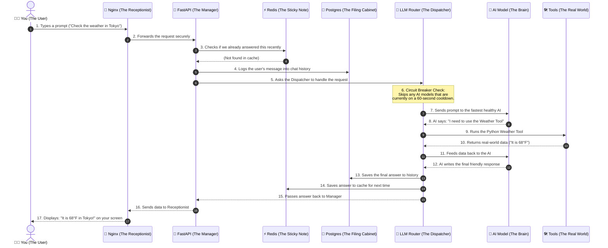

# AgentHive: A Chronological Journey (Layman's Guide)

Welcome to the detailed, step-by-step breakdown of how AgentHive works. Instead of using complex engineering jargon, we are going to follow a single chat message on its journey from your keyboard, deep into the AI's brain, and back to your screen.

Think of AgentHive as a highly organized corporate office. You are the Client, and the system is filled with Receptionists, Managers, File Clerks, and Specialized Contractors (the AI Agents).

---

## The Chronological Flow Diagram

Here is the exact sequence of events, laid out in chronological order:

---

## Step-by-Step Detailed Explanation

Let's zoom in on what actually happens in each of these chronological steps.

### Step 1 & 2: The Front Door (Nginx)
When you press "Enter" on your computer, your message travels over the internet and arrives at our server. 
The very first thing it hits is **Nginx**. 
- **What is it?** Nginx acts as the building's **Receptionist**. 
- **Why is it there?** You can't just let strangers walk directly into the back office. Nginx checks your request, ensures it is secure (using HTTPS/SSL), and then routes it to the correct department. If it's a request for a web page, it sends it to the Frontend (Next.js). If it's a chat message for the AI, it sends it to the Backend (FastAPI).

### Step 3 & 4: The Memory Systems (Redis & Postgres)
Once the **FastAPI Backend** (The Manager) receives your message, it needs to do some paperwork before waking up the AI.
- **Redis (The Sticky Note)**: Redis is incredibly fast memory. The Manager checks Redis to see if someone else asked this exact same question 2 seconds ago. If they did, the Manager just reads the sticky note and replies instantly, saving money and time.
- **Postgres (The Filing Cabinet)**: If it's a new question, the Manager securely logs your message into a permanent filing cabinet (Postgres). This is how the system remembers your past chat history when you log back in tomorrow.

### Step 5 & 6: The Smart Dispatcher & The Circuit Breaker
Now, the Manager hands your request to the **LLM Router** (The Dispatcher). The Dispatcher's job is to figure out *which* AI model should answer your question.

This is where the **Smart Circuit Breaker** comes in. 
Sometimes, an AI provider (like Google Gemini) gets overwhelmed by too many people using it worldwide. When we try to talk to it, Gemini shouts back: *"Error 429: Too Many Requests! I am busy!"*

Instead of stubbornly asking Gemini again and again (which would freeze your screen for a minute), our Dispatcher is smart:
1. It catches that "Busy" error immediately.
2. It places Gemini on a **60-Second Cooldown** (a temporary blocklist). We use 60 seconds because AI traffic jams usually clear up in about a minute. If we banned it for 24 hours, we'd be throwing away a perfectly good AI for no reason!
3. The Dispatcher instantly forwards your request to the next available AI (like Groq or HuggingFace) so you never even notice a delay.

### Step 7 to 12: The ReAct Loop (Agents and Tools)
Now the healthy AI (The Brain) has your prompt. But here is a secret: **AI models cannot actually do anything.** They can't browse the internet, they can't save files, they just predict text.

To fix this, we use a loop called **ReAct** (Reasoning + Acting).
- **Reasoning**: The AI reads your prompt ("Check the weather in Tokyo") and thinks: *"I don't know the current weather. But I see I have a tool called `weather_tool`. I will use it."*
- **Acting (The Tool)**: The AI sends a command back to our server saying: *"Hey Manager, please run the weather script for Tokyo."* 
- **The Real World**: Our server physically runs a Python script (the Tool) that checks a real weather website, grabs the temperature, and hands the text back to the AI.
- **Observing**: The AI looks at the data ("68°F") and writes a polite, conversational response for you.

### Step 13 to 17: The Delivery
The hard work is done! 
- The Manager (FastAPI) takes the AI's final answer and stores it in the **Filing Cabinet** (Postgres) so it is saved in your chat history.
- It also writes the answer on a **Sticky Note** (Redis) just in case someone asks the exact same question in the next few minutes.
- Finally, the Manager hands the response back to the **Receptionist** (Nginx), who securely beams it across the internet and right onto your screen.
