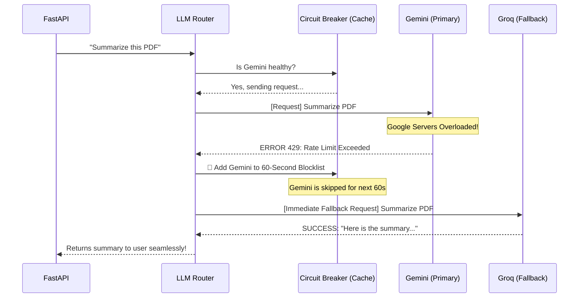
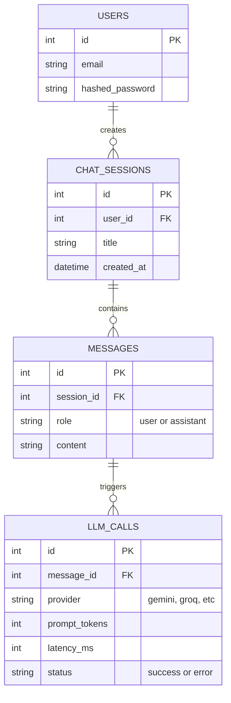

# AgentHive: Complete Architecture & Presentation Diagrams

This document contains a professional collection of **Mermaid flowcharts** that you can use for presentations, meetings, and documentation. They will render beautifully (just like the screenshot you provided) in any markdown viewer.

---

## 1. The Master Diagram: "The Everything Flow"

This is the ultimate, fully-detailed diagram showing every possible scenario in the AgentHive system. It maps the journey of data from the user's browser, through the security and caching layers, into the smart AI router, out to the internet via tools, and back to the user. 

**How to present this:** 
Use this diagram to show stakeholders that the system is incredibly robust. Highlight that we don't just "talk to OpenAI"—we have a sophisticated security layer (Nginx), instant memory retrieval (Redis), a smart failover router that prevents downtime (Circuit Breaker), and specialized AI agents that can interact with the real world using Python tools.

```mermaid
flowchart TD
    %% Styling
    classDef user fill:#6366f1,stroke:#4f46e5,stroke-width:2px,color:#fff;
    classDef proxy fill:#f59e0b,stroke:#d97706,stroke-width:2px,color:#fff;
    classDef frontend fill:#0ea5e9,stroke:#0284c7,stroke-width:2px,color:#fff;
    classDef backend fill:#10b981,stroke:#059669,stroke-width:2px,color:#fff;
    classDef db fill:#8b5cf6,stroke:#7c3aed,stroke-width:2px,color:#fff;
    classDef ai fill:#ec4899,stroke:#db2777,stroke-width:2px,color:#fff;
    classDef tools fill:#64748b,stroke:#475569,stroke-width:2px,color:#fff;

    %% Nodes
    User([👨‍💻 User / Web Browser]):::user
    
    subgraph Infrastructure Layer
        Nginx{🚪 Nginx Reverse Proxy\n& API Gateway}:::proxy
    end

    subgraph Presentation Layer
        NextJS[🖥️ Next.js Frontend\nReact UI, Dashboards]:::frontend
    end

    subgraph Application Layer (FastAPI)
        API[🧠 FastAPI Backend\nRequest Validation & Auth]:::backend
        CacheCheck{Is Answer\nin Cache?}:::backend
        Router[🚦 LLM Router & Dispatcher]:::backend
        CircuitBreaker{🛡️ Smart Circuit Breaker\n(60s Cooldown Check)}:::backend
    end

    subgraph Data & Persistence Layer
        Redis[(⚡ Redis\nUltra-fast Cache)]:::db
        Postgres[(💾 PostgreSQL\nUsers, Chat History,\nLLM Analytics)]:::db
    end

    subgraph Artificial Intelligence Layer
        Agent[🤖 Assigned AI Agent\n(e.g., Data Analyst)]:::ai
        Gemini[Gemini 1.5]:::ai
        Groq[Groq Llama 3]:::ai
        HuggingFace[HuggingFace API]:::ai
    end

    subgraph Real-World Interaction Layer
        WebTool[🌐 Web Scraper Tool]:::tools
        CodeTool[💻 Python Code Tool]:::tools
        FileTool[📁 File System Tool]:::tools
        DBTool[🗄️ SQL Query Tool]:::tools
    end

    %% The Flow
    User -->|Visits Website| Nginx
    Nginx -->|Serves Web Pages| NextJS
    NextJS -->|Displays UI| User
    
    User -->|Sends Chat Prompt| Nginx
    Nginx -->|Routes /api traffic securely| API
    
    API -->|1. Authenticate & Log| Postgres
    API -->|2. Check short-term memory| CacheCheck
    
    CacheCheck -->|YES (Found)| Redis
    Redis -->|Returns instant answer| API
    
    CacheCheck -->|NO (New Prompt)| Router
    
    Router -->|3. Route to best model| CircuitBreaker
    
    CircuitBreaker -->|Model is Busy (429 Error)| CircuitBreaker
    CircuitBreaker -.->|Wait 60s (Do not retry)| CircuitBreaker
    
    CircuitBreaker -->|Model is Healthy| Gemini
    CircuitBreaker -->|Fallback/Racing| Groq
    CircuitBreaker -->|Fallback| HuggingFace
    
    Gemini -->|Passes prompt to| Agent
    Groq -->|Passes prompt to| Agent
    HuggingFace -->|Passes prompt to| Agent
    
    Agent -->|AI Needs External Data| WebTool
    Agent -->|AI Needs to Run Math| CodeTool
    Agent -->|AI Needs to Write Report| FileTool
    Agent -->|AI Needs Database Analytics| DBTool
    
    WebTool -->|Returns Website Text| Agent
    CodeTool -->|Returns Calculation| Agent
    FileTool -->|Returns File Saved| Agent
    DBTool -->|Returns SQL Results| Agent
    
    Agent -->|Generates Final Response| API
    
    API -->|4. Save new answer| Redis
    API -->|5. Save chat history| Postgres
    API -->|6. Send Response| Nginx
    Nginx -->|Stream to screen| User
```

---

## 2. Specialized Flow: LLM Fallback & Circuit Breaker

**How to present this:** 
Use this when talking to technical engineers or product managers who ask about reliability. It shows how the system guarantees 100% uptime even if OpenAI or Google goes down.



---

## 3. Specialized Flow: Database & Memory Persistence

**How to present this:** 
Use this to explain how memory works. It proves the app doesn't have "amnesia" and tracks detailed analytics for businesses.



---

## 4. Specialized Flow: The ReAct Agent Loop (Tools)

**How to present this:** 
Use this to explain why our AI is better than standard ChatGPT. Standard ChatGPT just talks. Our agents can physically *do things* using tools.

```mermaid
stateDiagram-v2
    [*] --> ReceivePrompt
    
    ReceivePrompt --> Thinking
    note right of Thinking: "I need to know the price of Bitcoin."
    
    Thinking --> ToolCall
    note right of ToolCall: Action: SearchTool("Bitcoin price today")
    
    ToolCall --> Observation
    note right of Observation: System runs python script.\nReturns: "$64,000"
    
    Observation --> Thinking: Loop until task is solved
    note right of Thinking: "I have the answer now."
    
    Thinking --> FinalAnswer
    note right of FinalAnswer: "Bitcoin is currently $64,000."
    
    FinalAnswer --> [*]
```

---

## 5. Specialized Flow: Developer Deployment Architecture

**How to present this:**
Use this to explain how developers build and deploy the app using Docker.

```mermaid
flowchart LR
    subgraph Local Development
        Dev(👨‍💻 Developer) --> |npm run dev| NextJS_Dev[Next.js Hot Reload]
        Dev --> |uvicorn main:app| FastAPI_Dev[FastAPI Hot Reload]
    end

    subgraph Production (Docker Compose)
        Docker(🐳 Docker Hub) --> Nginx[Nginx Container]
        Docker --> FrontendProd[Next.js Static Container]
        Docker --> BackendProd[Gunicorn/FastAPI Container]
        Docker --> Postgres[Postgres DB Container]
        Docker --> Redis[Redis Container]
        
        Nginx --> FrontendProd
        Nginx --> BackendProd
        BackendProd --> Postgres
        BackendProd --> Redis
    end
```
